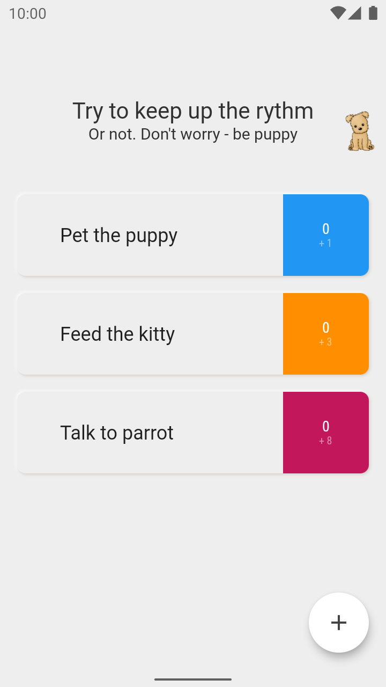
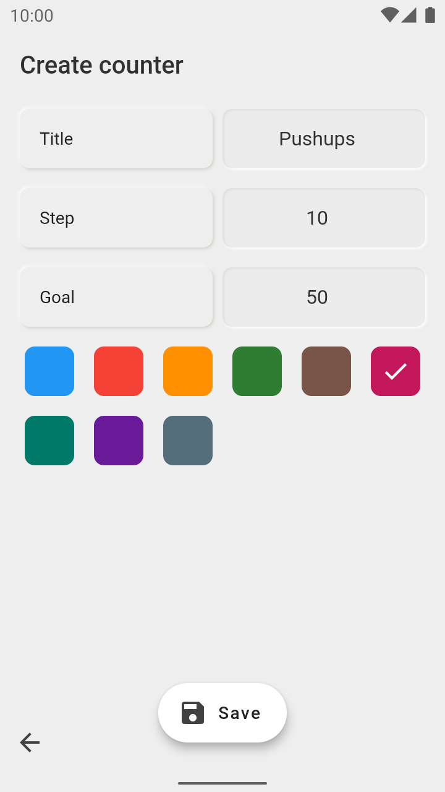
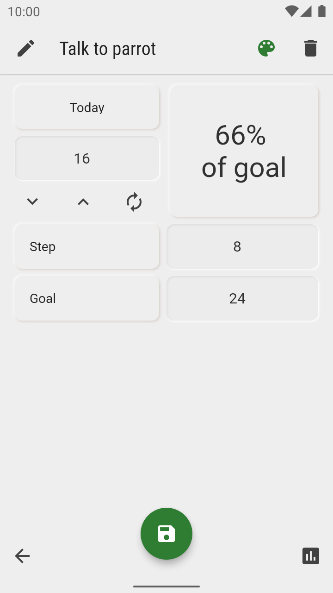
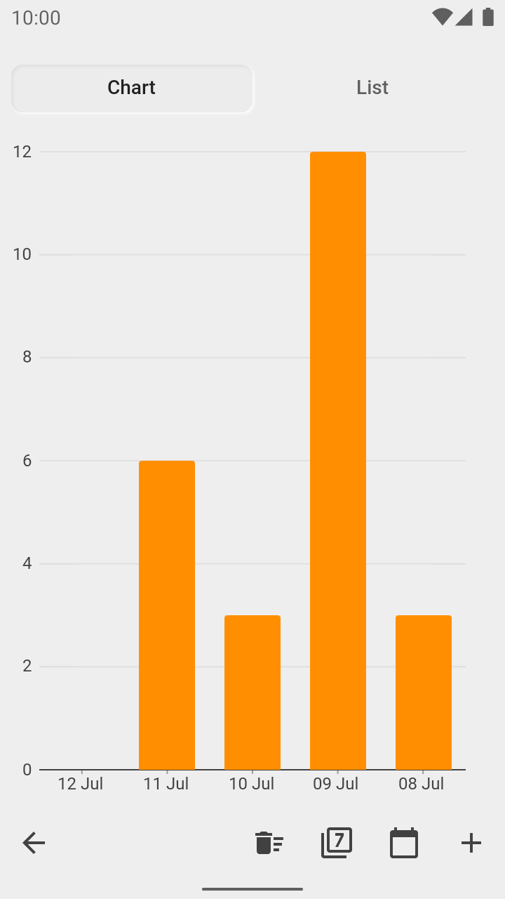

# About project

No longer starter, but not very advanced [Flutter](https://flutter.dev/docs/get-started/install) project. Trying to implement `BLoC` architecture with the [Didier's Boelens](https://www.didierboelens.com/) aproach.

Although `BLoC` looks and feels pretty consistent, however needs a lot of boilerplate code, and `Dart` as language does not always seem trying to *make it easier* (however, it develops – as far as I can see – in a right way). Thus, any architecture is better than none. `BLoC` serves its purpose, the same as Dart.

Not using `Isolates` in this app – there are no heavy computations. Still, a lot of `async/await`.

### Contacts

[Telegram](https://t.me/pinq_punq)

[LinkedIn](https://www.linkedin.com/in/faserschreiber)

### Getting Started

No need for any tokens or tuning. Install `Flutter` and compile app. Tested on `Android` device and `iOS` simulator.

### UI notes

Neumorphism look interesting and fresh, still low contrast is not great. Attempts to apply to it more contrast looks too bizzare and extravagantly (for me). So `total neumorphism` is not acceptable (for me (for now)). So in this app I tried to apply it to some elements. It's far from perfect, but looks ok. So, let it be. 

### Screenshots
Main Screen              | Create Screen           | Details Screen          | Chart Screen            |
:-----------------------:|:-----------------------:|:-----------------------:|:------------------------:
||||

### Code style and architecture notes

Use this code as you wish at your own risk. Do not expect to see here `the right way` of doing things. Still, if it can help someone to learn a couple of `not todos`, I will be satisfied 😉

#### Todo notes, UX, some elements behavior

- `BottomAppBar` UX is great because of `Back` button available at the bottom of the screen, though it looks weird with classic Android 3-button style navigation.
- Two-line title on a main screen `TopAppBar` looks as nice when expanded as ugly when collapsed.
- `Chart`. I tried several libraries and was not satisfied. One was laggy, the other was ugly. Used now is very simple to set up.
- `Animations`. I tried oficial [animations](https://pub.dev/packages/animations) package, that implements material motion. It was lagging on my old (still not useles) Nexus 5.
- Sometimes looks like the app needs to drop some frames and warm up, first animations are laggy, then app work fine. Not satisfied.
- Dark theme.
- Inconsistent of different BLoC's desing, because of experiments.

# Copyright notes

### Used images

- [Launcher icon](https://www.flaticon.com/free-icon/countdown_470112) by [Freepik](https://www.flaticon.com/authors/freepik) from [Flaticon](https://www.flaticon.com/)

- [Dog](https://pixabay.com/illustrations/dog-sitting-pet-domestic-brown-5188108/) in TopAppBar by [Jorgeduardo](https://pixabay.com/users/Jorgeduardo-8516248/) from [Pixabay](https://pixabay.com)

- [Flower](https://pixabay.com/illustrations/henna-designs-henna-floral-mandala-4869483) on splash screen by [Annalise Batista](https://pixabay.com/users/AnnaliseArt-7089643) from [Pixabay](https://pixabay.com)

## Third-party libraries

- [Didier Boelens](https://www.didierboelens.com/) web-site with great `Flutter` articles and examples. Helped me a lot to understand things. Do not forget that the one's way of thinking and explaining may not be your way. Try to search resources that are usefull for you.

- [rxdart](https://pub.dev/packages/rxdart). People in community say that there is no necessity to use `rxdart`, having Dart streams. In my case, at the beginning there were some cases of strange behavior of build-in streams, and I ended up sticking with rxdart. 

- [shared_preferences](https://pub.dev/packages/shared_preferences). Library to store a small portions of data in `key-value` pairs.

- [sqflite](https://pub.dev/packages/sqflite). Library to work with `SQLite`.

- [path](https://pub.dev/packages/path). A string-based path manipulation library.

- [intl](https://pub.dev/packages/intl). Library for internationalization and localization by Dart team.

- [charts_flutter](https://pub.dev/packages/charts_flutter). Chart library that is easy to start with and does not look very laggy.

## Notes not to forget

- StackOverflow [answer](https://stackoverflow.com/a/59408336/8460732) about hide on scroll `FloatingActionButton`

## Google play description

Simple Flutter application to count anything. This is an open-source demonstration project. You can see its source code <a href="https://github.com/tinted-knight/counters">on Github<a/>.

This app does not contain ads nor in-app purchases. Does not require any permissions.

Just tap on counter's value on Main screen to increase it.

Each counter has:
- Daily goal
- Increment step
- Color
- Title

Every day app resets all counters to zero and saves last value to history

In History screen, you can:
- Observe counter's history as list and simple Chart
- Edit entries
- Add missing entries

Have fun! Leave feedback if something had gone wrong.
